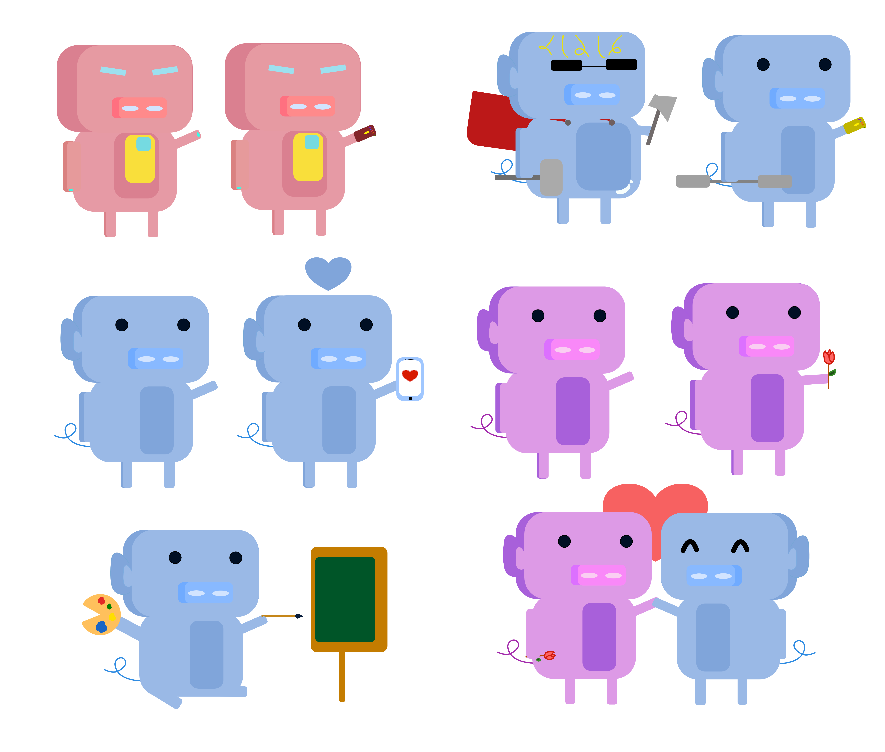

# EmojiPack
Discord [#hackweek](https://blog.discordapp.com/discord-community-hack-week-build-and-create-alongside-us-6b2a7b7bba33) emoji. I divided this into 6 groups of emojis. 

With **53** different emojis, and **4** of them have animated version!

Full list: 


#### ```Table of contents``` 

| Normal emoji     | Discord face emoji   | Letters emoji  | Pixelated emoji | Animated emoji  | Discord pig emoji |NOTES   |
| :-------------: |:-------------:| :-----:|:------:|:----:| :-----:| :-----:|
| [here](#Normal-emoji)    | [here](#Discord-face-emoji) | [here](#Letters)| [here](#Pixelated-emoji) | [here](#Animated-emoji) | [here](#Discord-Pig)  |[here](#NOTES)|

## Normal emoji

A.K.A extended emojis.

_You don't think you need these until you see these:_


When you type in ":/", it becomes :confused: 

or ":P", it becomes :stuck_out_tongue: 

or ":v", it becomes packman face; you don't like that? then the emojis above fit perfectly with what you type.

## Discord face emoji

_Memers, here you go_


Some emojis have alternatives 

#### ```FOR MEMERS EXCLUSIVELY```


## Letters 

_gg and F is a must-have in gaming!_


## Pixelated emoji

_It represents gaming!_


## Discord Pig

_Who doesn't love marvel and cute pigs?_



Thor is fat!

## Animated emoji

_It can moves??_

<p float="left">


</p>

Available in ```/animation``` (gif file) and ```/video``` (.MOV file -- higher quality)

## NOTES

```/video/``` contains video files for the animations.

```emojiPackNoBG.png ``` is a transparent file, so do all the videos in ```/video```.

```readme.md``` is available in every folder.
