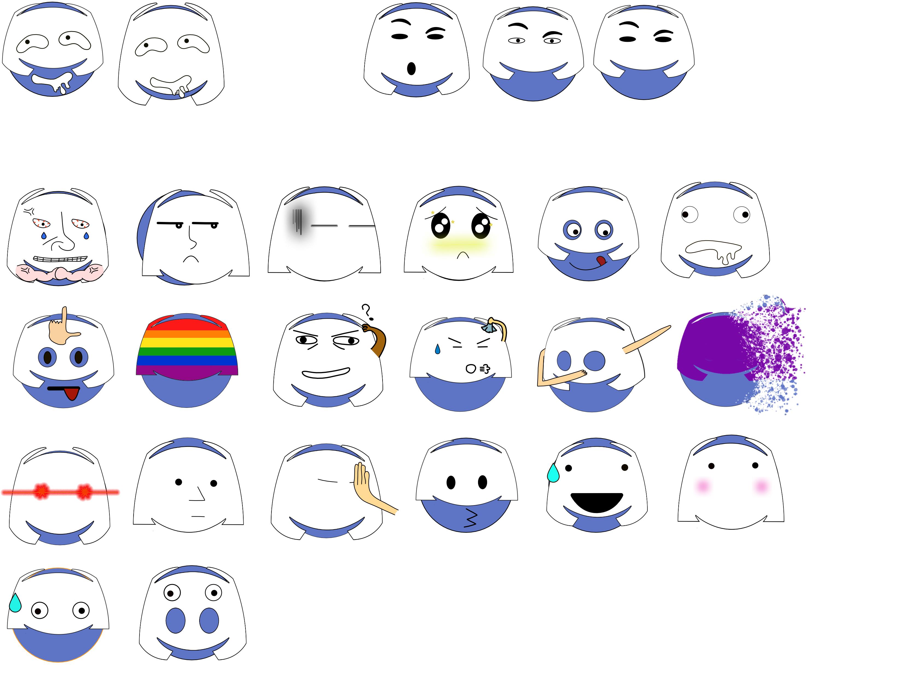
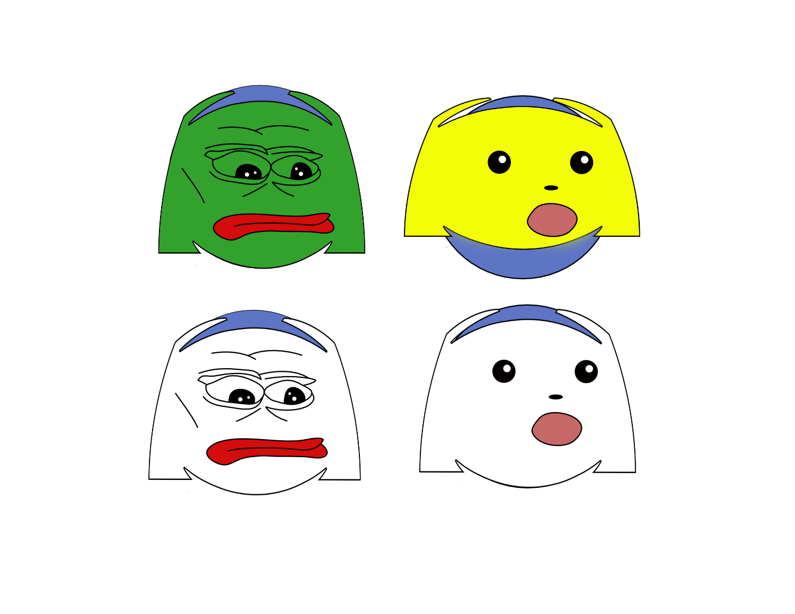
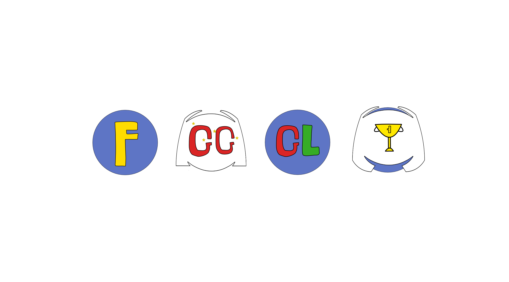
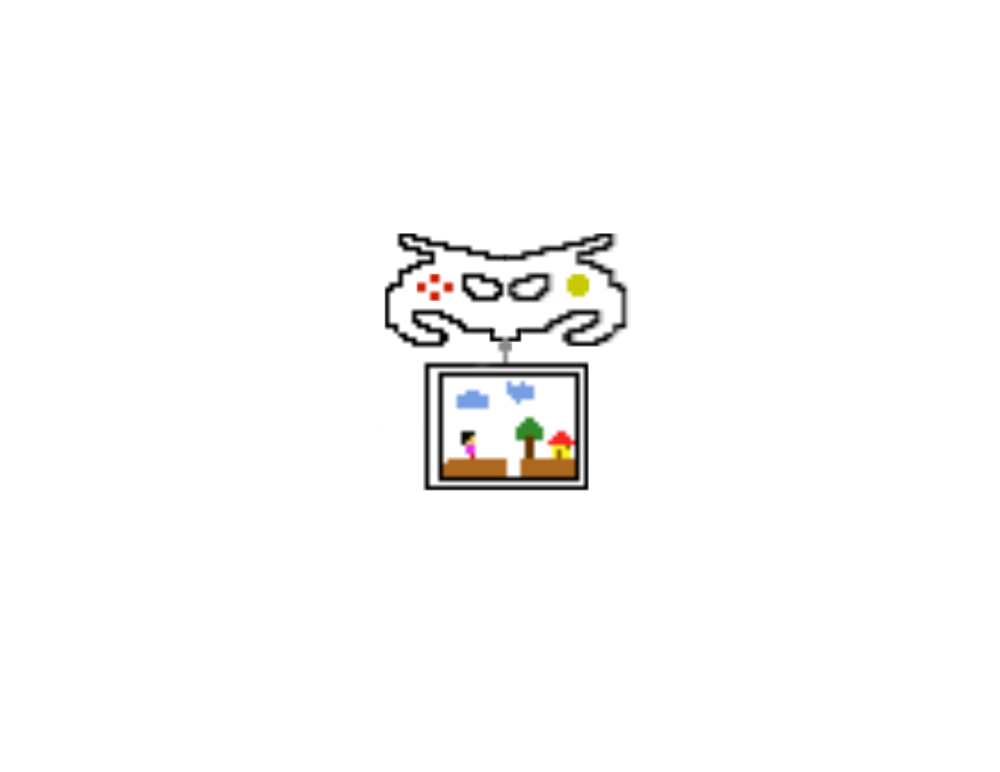
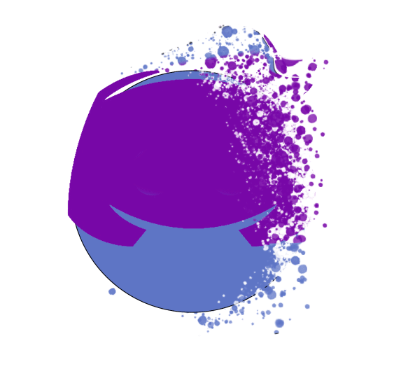
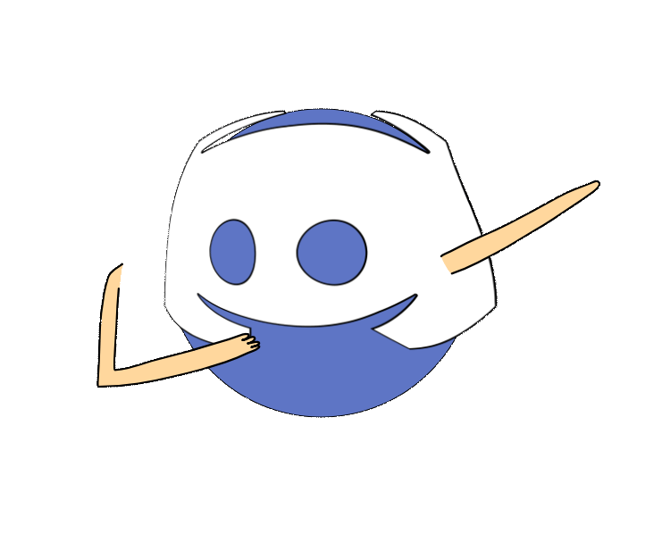
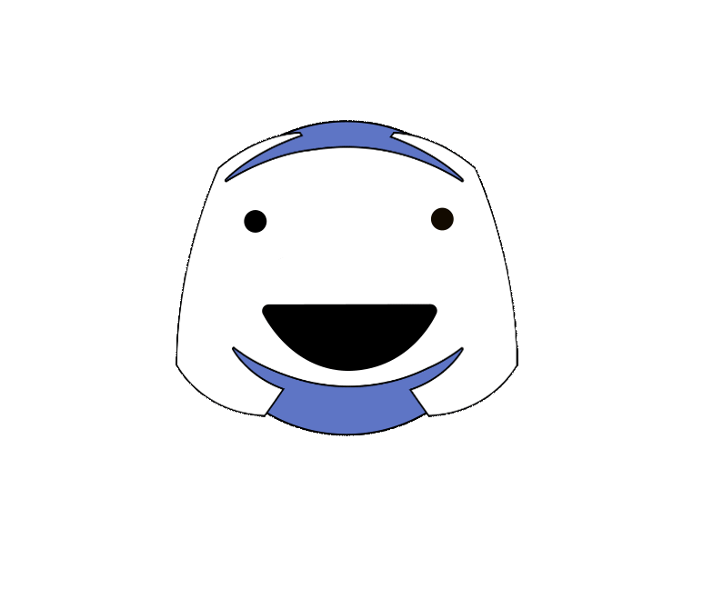
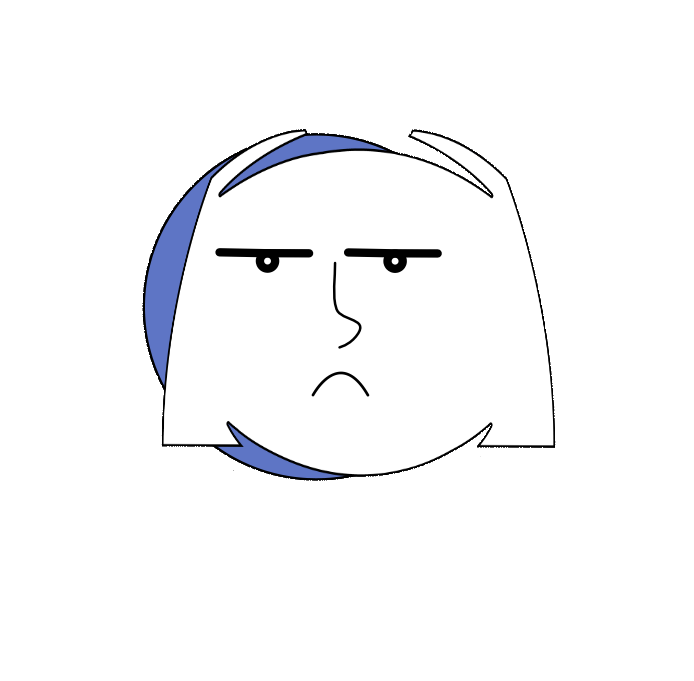

# EmojiPack
Discord hackweek emoji. I divided this into three groups of emojis

Content:

| Table of contents        |            |   |   |  |
| ------------- |:-------------:| :-----:|:------:|----:|
| [Normal emoji](#Normal-emoji)    | [Discord face emoji](#Discord-face-emoji) | [Letters](#Letters)| [Pixelated emoji](#Pixelated-emoji) | [Animated emoji](#Animated emoji) |

## Normal emoji

_You don't think you need these until you see these_


When you type in ":/", it becomes :confused: 

or ":P", it becomes :stuck_out_tongue: 

or ":v", it becomes packman face; you don't like that? then the emojis above fit perfectly with what you type.

## Discord face emoji

_Memers, here you go_



Some emojis have alternatives 

#### ```FOR MEMERS EXCLUSIVELY```



## Letters 

_gg and F is a must-have in gaming!_



## Pixelated emoji

_It represents gaming!_



## Animated emoji

_It can moves??_

<p float="left">




</p>

I use gif atm but it does not look very good. You can use pdf file in ```/psd/``` to generate mp4 or whatever you want.

snap.gif has white background because it looks awful without background.
